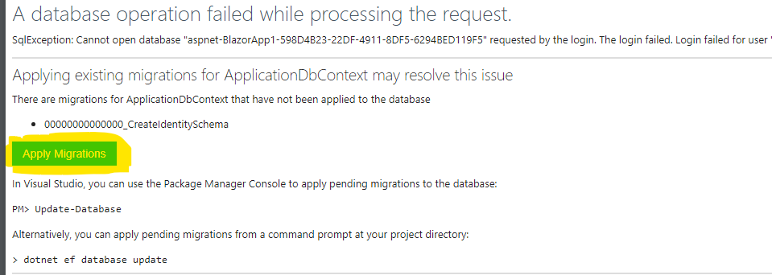
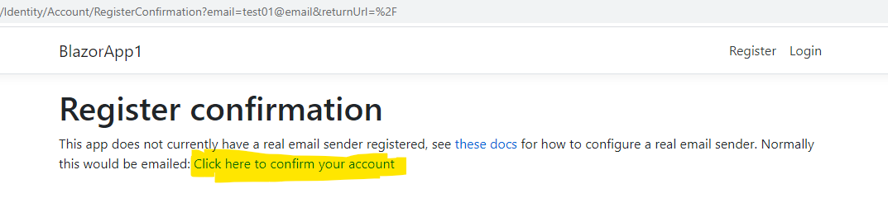
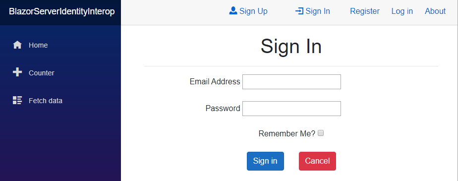

# BlazorServerIdentityInterop

## Blazor Server Identity via Interop

Project demonstrating scaffolding MS Identity into a Blazor Server project and converting the scaffolded pages to Blazor/Razor pages

The simplest form of Identity within Blazor Server is Individual User Accounts.
These are generated by Scaffolding Identity. 
But the output are Razor pages (*.cshtml/*.cs) not Blazor Components (*.razor).
The Login and Logout pages use `SignInManager` to perform the actual loggin in and logging out of a user.
However, there are technical limitations to `SignInManager` and `UserManager` that prevent them from *Signing In* a user and therefore are not supported under Blazor.
It is a bit of a Gordian knot to get Identity work for Blazor Server (Webassembly is a different story.)
The *sword* for this knot is to utilize the Razor pages called from Blazor pages.  But there are variations on this approach.
This variation attempts to use Blazor pages for the UI, and Razor class [verify this] for the processing.

There are different ways of communicating between Blazor and Razor pages.  
This project will use JavaScript InterOp.  
This solution comes from Shaun Walker of the Oqtane project *Insert link*
This may be considered a *hack*, but it follows standard architecture of all solutions in this space.
1. Obtain an anti-forgery token from the system and make it available to Blazor components
   1. Blazor HttpContext is set at startup and does not refresh.  Therefore not usable.  This is where the token lives.
   2. Non-Blazor spaces do have access to the AF token and can get the latest one.
2. Build a submission, including the AF token, and send to Login for SignIn.
   1. The Login razor page expects a POST with the AF token attached.  
   2. If a property AF is attached to POST, the middleware will pass on the request to Login
   3. Because Login is not in *Blazor space* (not SignalR), it is HttpContext aware, and can perform the Login.
   4. When returning, Login will attach the Identity token needed by Blazor Authentication.
3. Return the Identity token to AuthenticationStateProvider in *Blazor Space*, which can indicate the Authentication state, and Authorization rights of the user.

## Considerations 
* When doing a POST, security requires dealing with Cross Site Scripting Attacks (XSRF).  
Anti-Forgery tokens are best practice for Asp.Net.

## Create a Blank Blazor Project. 

### Commit to repo and Base 00.00.00

## Scaffold Identity 
* Override all files
* Create new context
* Optional use SqLite
* Create new User class
* Finish
* Compile
  * Fix error in RegisterConfirmation.cshtml.cs
    * Add `using Microsoft.AspNetCore.Identity;`
* Launch application
* No Sign Up / Sign In / Sign Out visibile (SUSISO) 
* 
### Commit to repo Base 00.01.00

## SUSISO Menu
* Need to augment the menu for SUSISO  options and display current Authentication State.

### App.razor
* Add the tag `<CascadingAuthenticationState>` around everything
```
<CascadingAuthenticationState>
    <Router AppAssembly="@typeof(Program).Assembly">
        <Found Context="routeData">
            <RouteView RouteData="@routeData" DefaultLayout="@typeof(MainLayout)" />
        </Found>
        <NotFound>
            <LayoutView Layout="@typeof(MainLayout)">
                <p>Sorry, there's nothing at this address.</p>
            </LayoutView>
        </NotFound>
    </Router>
</CascadingAuthenticationState>
```
### LoginDisplay.razor
* Create Blazor component *Shared/LoginDisplay.razor**
* Paste in the following:
```c#
```
### Navmenu.razor
* Edit *MainLayout.razor* and add element *<LoginDisplay>*
    ```c#
    @inherits LayoutComponentBase

    <div class="sidebar">
        <NavMenu />
    </div>

    <div class="main">
        <div class="top-row px-4">
            <LoginDisplay />
            <a href="https://docs.microsoft.com/aspnet/" target="_blank">About</a>
        </div>

        <div class="content px-4">
            @Body
        </div>
    </div>
    ```
### Startup.cs
* Add `app.UseAuthentication();` and `app.UserAuthorization();`
```c#
    app.UseRouting();

    app.UseAuthentication();
    app.UseAuthorization();

    app.UseEndpoints(endpoints =>
```

### Compile and Test
* Clean up any issues
* Should see a Hello World similar to this:
  > 
* Sign Up and Sign In are highlighted because they will use new Blazor Components to be built.
* The Register and Login are the Razor pages built by scaffolding.  We will keep them on the menu for the moment.
* Stop application

### Provision Database
* Package Manager Console
* `add-migration m1`

    ```
    PM> add-migration m1
    Build started...
    Build succeeded.
    To undo this action, use Remove-Migration.
    PM> 
    ```
* `update-database`
  
    ```
    PM> update-database
    Build started...
    Build succeeded.
    Done.
    PM> 
    ```
## Log Out
The legacy Logout uses a POST call with no data.  
Trouble is, it causes a `AntiForgeryValidationException`.
We need to disable AF for the moment.

### Logout.cshtml.cs
* Add an `[IgnoreAntiForgeryToken]` attribute to the top of the class.
    ```c#
        [AllowAnonymous]
        [IgnoreAntiforgeryToken]
        public class LogoutModel : PageModel
    ```

### Retest
* Launch app
* Use the legacy Register Link
* Register an account
* Confirm the account by clicking *Click here to confirm your account*
* Click on the Home link of the project name *BlazorServerIdentityInterop*
* Click on the legacy  *Log in* link.
* Proceed to Login
* The menu will change to should the username used (email), and Sign Out & Log out display.
  > 
* Different menu items are displayed depending on the Authentication state.

### Commit to Repo Base 00.02.00

## Implement Interop to utilize cookies.
The following steps are changes needed to gain access to the AF token, and POST a form to Login.

### wwwroot/js/Interop.js
Borrowed from the Oqtane project (https://www.oqtane.org/) and 
Shaun Walker blog "Exploring Authentication in Blazor" (https://www.oqtane.org/Resources/Blog/PostId/527/exploring-authentication-in-blazor)

Only interested in 2 routines:

    ```
    getElementByName: function (name) {
        var elements = document.getElementsByName(name);
        if (elements.length) {
            return elements[0].value;
        } else {
            return "";
        }
    },
    submitForm: async function (path, fields) {
        const form = document.createElement('form');
        form.method = 'post';
        form.action = path;

        for (const key in fields) {
            if (fields.hasOwnProperty(key)) {
                const hiddenField = document.createElement('input');
                hiddenField.type = 'hidden';
                hiddenField.name = key;
                hiddenField.value = fields[key];
                form.appendChild(hiddenField);
            }
        }

        document.body.appendChild(form);
        var response = await form.submit();
    },
    ```
  * The `getElementByName` will be used to retrieve the AF token from the Document
  * The `submitForm` will be used to dynamically build and submit a form via a POST call. 

### Shared/Interop.cs
This file is a C# wrapper for the Javascript methods in Interop.js.  
Actual location is not hugely important, so it was placed in the Shared location.
The only 2 wrappers that will be used are `GetElementByName()` and `SubmitForm()`  
The full code is in the repo.

### Pages/Host.cshtml
* Add one call to embed the token in the client html
    ```html
    <body>
        @(Html.AntiForgeryToken())
        <app>
    ```
* Add the following line to load the *interop.js* file
    ```html
        <script src="_framework/blazor.server.js"></script>
        <script src="~/js/Interop.js"></script>
    </body>
    </html>
    ```

### SignIn
SignIn is the most difficult flow, so lets start there.  We will begin with supporting files.

#### SignIn.razor
* In Areas/Identity/Pages/Account, create SignIn.razor
* Copy the source code from the repository

#### Key elements
    ```c#
        protected override async Task OnAfterRenderAsync(bool firstRender)
        {
            if (firstRender)
            {
                var interop = new Interop(_jsruntime);
                AntiForgeryToken = await interop.GetElementByName("__RequestVerificationToken");
            }
    ```
  * The first time time the page is rendered, a call is made to retrieve the AF token which is embedded in element *__RequestVerificationToken**
  * The result is stored in `AntiForgeryToken`
  
```
        var fields = new
        {
            __RequestVerificationToken = AntiForgeryToken
            , email = Input.Email,
            password = Input.Password,
            remember = Input.RememberMe,
            returnurl = "/SignIn"
        };
        var interop = new Interop(_jsruntime);
        await interop.SubmitForm("Identity/Account/Login", fields);
        HttpResponseMessage response = new HttpResponseMessage();
```
* `fields` is an anonymous array of key values.
* Notice has `AntiForgeryToken` is passed in.
* A call is made to `SubmitForm()`
  * Though this call is `await`ed, there is no reponse message.  So an empty one is created.
* The Javascript method will POST the data to Login, where it will be processed the same as if it came from the Login View, as we did in our earlier login.

### Test 
* Launch the app
* Click on the new  menu item.
* The new Sign In screen is displayed
  > 
* Proceed to Sign In
* If successful, the top line menu display will change.  
* But this time the UI is all Blazor, and should proceed smoothly.

### Commit to Repo Base 00.03.00


## Sign Out
* Create a Blazor component called *SignOut.razor*
* This is pretty much like *SignIn.razor*, except no UI, and call Logout instead.
     ```c#
    @page "/SignOut"

    @using System.Threading.Tasks;
    @using Microsoft.AspNetCore.Antiforgery;
    @inject IJSRuntime _jsruntime;

    @code {
        //Will tell us if signed in or nor
        [CascadingParameter] public Task<AuthenticationState> authenticationStateTask { get; set; }

        // local property for the AF
        private string AntiForgeryToken { get; set; }

        // Execute after UI has rendered.  This allows it to fire once and only once.
        protected override async Task OnAfterRenderAsync(bool firstRender)
        {
            var authState = await authenticationStateTask;

            if (firstRender && authState.User.Identity.IsAuthenticated)
            {
                // Get the AF token
                var interop = new Interop(_jsruntime);
                AntiForgeryToken = await interop.GetElementByName("__RequestVerificationToken");

                // Build a form list
                var fields = new
                {
                    __RequestVerificationToken = AntiForgeryToken
                    , returnurl = "/SignOut"
                };

                // Post the message
                await interop.SubmitForm("Identity/Account/Logout", fields);
            }

            await base.OnAfterRenderAsync(firstRender);
            return;
        }
    }

    ```
### Test
* Use `Sign In`
* Use `Sign Out`

### Optional Put out a Message
* Add a little text once Signed Out
    ```
    @inject IJSRuntime _jsruntime;

    <AuthorizeView>
        <NotAuthorized>
            <h2 class="text-center">You are signed out</h2>
        </NotAuthorized>
    </AuthorizeView>

    @code {

    ```

### Commit to Repo Base 00.03.01

