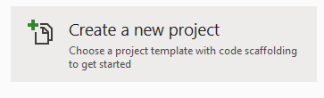
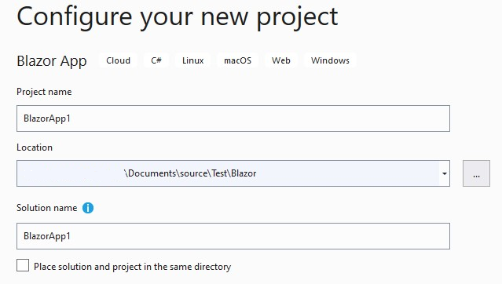
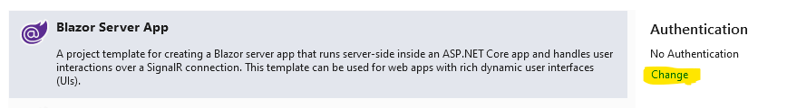
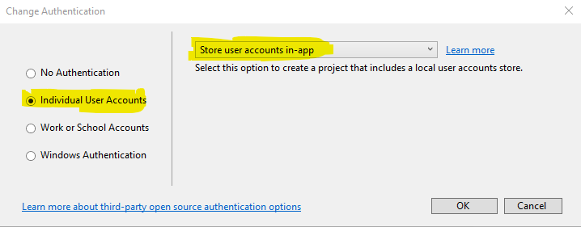
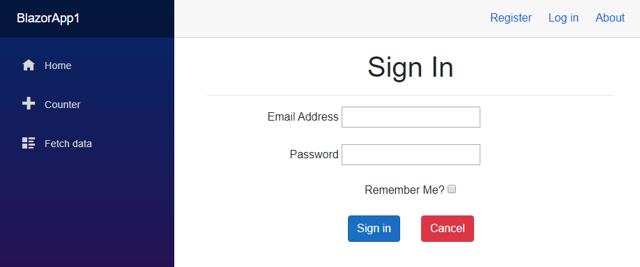

# BlazorServerIdentityInterop

## Blazor Server Identity 

Blazor Server Identity (BSI) is about utilizing MS Identity in Blazor applications that are hosted on the Server.  
Not a combination of Server and Web Assembly (WASM).

### Use Cases
 There are many different ways of implementing Identity, depending on the Use Case:
* Education purposes.
* Solo Development
* Team Development
* Enterprise Development
* Test, Stage, Production deployment.  

These are just some of the possible use cases that influence the choice of implmentation.

### Sign Up, Sign In, Sign Out (SUSISO)
SUSISO are the three core functions that any Identity solution must perform to be successful.

### Constraints
There are several mitigating factors that can hinder an implementation's choice.  Some of these are:
* UI/UX
  * Blazor pages have a unique look and feel which is just one may factors that make Blazor an attrative choice. 
    A SUSISO that is visually jarring to the user may not be acceptable.
  * SUSISO mechanics can be driven by Cyber Security and/or Regulatory issues (use of an email as primary Id may be a poor security choice in many industries.)
    If an Identity implementation cannot or only with great difficulty perform the correct UX, this becomes a mitigating factor.
* Scalability
  * Some implementations may be fine for small uses cases, but not for larger scale situations.  This must be taken into account.
* Security Best Practice
  * Security is not a boolean, but rather a level of effort and capability that surpass the threat level.
    In low threat environments some choices may be more practical than others.  High threat environments may require third party solutions or even custom implementations.  
* Complexity
  * Like security, highly complexity Identity implementations must be balanced against other factors, like prioritiztion, resource availability, cost, best practices.
   
#### Technical Constraints 
Blazor is different from other Web technologies, because of its reliance on Signal/R.  
An analogy I like to use is the difference between snail mail and the telephone: Both do their jobs exceedingly well, but their inherent differences means a solution for one doesn't carry over to the other.
Snail mail has postmarks, the _to_ and _from_ address.  The telephone has numbers and caller id.  Some of these differences can become obstacles to any BSI implementation.
* HttpContext is used for everything in Asp.Net Core.  But it is essentially R/O for Blazor pages purposes.
  * **...you must not use IHttpContextAccessor within Blazor apps** 
  * Strong stuff, but well explained.
    * https://docs.microsoft.com/en-us/aspnet/core/fundamentals/http-context?view=aspnetcore-3.1#blazor-and-shared-state
  * Many implementations **do** attempt to utilize HttpContext, and sometimes get away with it.  The above referenced page is the guidance, and I will follow it.
* **SignInManager<TUser> and UserManager<TUser> aren't supported in Razor components**
  * https://docs.microsoft.com/en-us/aspnet/core/security/blazor/?view=aspnetcore-3.1
  * Strike 2!  Ouch.  Razor Components = Blazor Components.  
  * SignInManager and UserManager are fundamental to MS Identity, providing abstraction to the underlying provider.  
  * There is no `SignInManager.Context` which would contain HttpContext.  This is especially true when the browser is not running on the server, Context=null.
  * Secondly, even on the box, SignInManager throws the dreaded "...because Rendering has already begun" exception when any kind of SignIn is attempted.
    Because of the fundamental nature of Blazor, I do not believe there is a way around these two issue.
  * UserManager appears to work without issue, but sometimes will grow stale, not reflecting changes to the DB.
* Authentication Cookie/Token not in the browser.
  * Some BSI implementations make API calls to non-Blazor code access to HttpContext and/or SignIn Manager. 
  A good tactic, but then upon return,  Authentication Cookie/Token is in the _Server_ memory, not in the client Browser.
  Most implementations reviewed that use this approach, also use WASM and client libraries to get the authentication cookie/token into the browser.
  * "Strike 3, yous outta dere!"
  
### Commentary
This is not an easy problem to solve, on the **low end**.  On the high end, there are ootb solutions, and a company can throw lots of resources to deploy an implemtation.
But at the low end, the individual or small shop building web apps for small businesses, and such, this is a pretty daunting challenge.
As Developers, the desire is to have a similar ootb experience as one gets with Asp.Net Core Identity.  But it is not there. 
Because the technologies are fundamentally different. This is the situation I found myself in.
That's why I went looking for guidance and solutions, and found myself slashing through the jungle. Not to worry, it is a jungle I've slashed through many times before.
 
### Implementations
Some of the possible implementations for BSI are:
* MVC/Razor Pages
  * Exactly the same as Asp.Net Core.
  * Approved/recommended approach.
  * Blazor pages navigate to Scaffolded or custom Razor pages.
  * **Upside** -- Out of the box (ootb) functionality.  Great for small dev, non Production projects
  * **Downside** -- Poor UI experience jumping betweeen Razor pages and Blazor components.
* API calls.
  * This is a very popular choice.  Scaffold a controller, implement APIs, call SignInManager within a Razor space that has a valid HttpContext.
  * **Upside** -- It takes care of Strike 1 and 2.
  * **Downside** -- But Strike three, getting the cookie/token into the browser is problematic.  
    Every successful implementation I've reviewed utilized WASM for the Client, and a Blazor Client library.  That is **not** a BSI implementation, 
    it  is a Hybrid, **and is a perfectly legitimate solution** for some use cases.  It just didn't fit my needs.
    * Another downside is complexity of the solution.  Not that is that complicated, just that compared to Asp.Net Core scaffolding MS Identity, it is hours versus minutes.
* Third Party solutions
  * Identity Server -- Haven't used this, or reviewed it closely, but I see a lot of recommendations for it and implementations.  Downside is complexity of implementation as compared to Asp.Net Core Identity.
  * Azure Active Directory --  Wow!  Out of the box, 5 minutes, boom, done.  Precisely as advertised. 
    **BUT** it is an AD forest, so users have to be enrolled in the forest.
    Ok, that would great for an internal web site.  Not going to work on the Internet.
  * Azure AD B2C -- Wow!  Another great solution.  A little more complicated to set up (see my BlazorServerIdentityADB2C), but still less than an hour.
    Got all the _ities_, Scalability, Security, Operability (backups), Managability, etc.  But, and you knew there was going to be a _but_: the UI/UX. 
    It doesn't look like Blazor, and the default behavior flow may not be satisfactory.  Yes, fully customizable, but, how long will it take?  What level of effort?
    Will there be dead-ends resulting in the dreaded _you can't get there from here_.
    If the UI can be improved through API calls, do we have the downsides from API calls above?  Questions for another day.
* RevalidatingIdentityAuthenticationServiceProvider (RIASP)
  * RIASP is generated by the default Blazor creation template when Identity is selected, before Scaffolding Identity is available. (see BlazorServerIdentityRIASP)
    RIASP is built atop ServerIdentityAuthenticationServiceProvider (SIASP) which does _host based authentication_, meaning hooking into on-prem AD. 
    But it can also hook into the local identity provider.  It doesn't need SignInManager.  A `ClaimsPrincipal` can be directly injected into Identity.
    There is no UI/UX issue, because it is 100% Blazor. 
    Code is only added to the project, no changes.  The additions are just to 3 files, so it is not complex.
    If templates were available, a developer would be up and running in minutes.  It scales, it is secure, easily customized.
  * **Downside**  No cookie/token in the client browser problem.  Refesh the screen and credentials are lost. 
    It is a new circuit, and the credentials were tied to the previous circuit. 
    This might be satisfactory for some use cases, specific scenarios, but a pretty major downside.
* Java Runtime Interop
  * While researching the cookie issue for RIASP, I came across writings of Mike Washington (http://blazorhelpwebsite.com/Blog/tabid/61/EntryId/4316/A-Demonstration-of-Simple-Server-side-Blazor-Cookie-Authentication.aspx)
  and Shaun Walker from Oqtane (https://www.oqtane.org/Resources/Blog/PostId/527/exploring-authentication-in-blazor) and how they dealt with this issue.
  To summerize, Oqtane posts a form with credentials to *Login.cshtml.cs* `OnPostAsync()` method using Javascript. 
  `OnPostAsync()` is in Razor space, so no different than calling MVC/Razor pages, just bypassing the markup.  This meant the UI/UX was all Blazor.
  No API to build.  No 3rd party solution to integrate with.  
  **Downside** 
    * First, getting the Token/Cookie into the browser. Oqtane solves this with 6 lines of Javascript that adds the data to the DOM.
    * Second problem was the Anti-Forgery Token.  The Oqtane solution was to modify _Host.cshtml_ adding the AF token before Blazor space.  
    Going back to the guidance on HttpContext and Blazor Shared Space, this is exactly what is proposed: do any HttpContext manipulations before/outside of Blazor space.
  * This approach just might address all the issues. 

  
## BlazorServerIdentityInterop 1.0
It works, and very satisfactorily.  However, several reviewers did not like the idea of inserting an AF token at the beginning of a circuit, and the reliance 
on a dynamically generated form to be posted to `Login.OnPostAsync()`.  But it works.

## BlazorServerIdentityInterop 2.0
MVC/Razor pages are the approved guidance for Idenity with Blazor.  (https://docs.microsoft.com/en-us/aspnet/core/security/blazor/?view=aspnetcore-3.1)
Using Login Razor page, it first makes a call to OnGet, which returns the Login form, with the AF token in a hidden field.  With some small changes to *Startup.cs*, the token will be added to a header by the Middleware.
So I took a new approach:
* Create a new project with Identity activated, but not scaffolded.
* Modify *Startup.cs* to add the AF token as a header.
* Create a custom *SignIn.razor*
  * Collects credentials in a form.  
  * `OnValidSubmit()` after checking validity of credentials
    * Make Http call to `Login.OnGet()` and get the form, with the AF token attached.
    * Build new request with Credentials + AF token in the Form data + AF token in the header.
    * Post the request to `Login.OnPostAsync()`  User credentials are validated.
    * Response (if successful) contains Authentication Cookie.
    * Use Oqtane's Interop.SetCookie to add it to the Document.
    * **Magic coming** Use `NavigationManager.NavigateTo("/", true)`
      * The `true` setting `If true, bypasses client-side routing and forces the browser to load the new page from the server, whether or not the URI would normally be handled by the client-side router.`
      * Voila, the authentication cookie is loaded into the browser, and all A&A facilities work as documented, and the UI/UX is just like Asp.Net Core, but 100% Blazor!
* There is the *interop.js* and wrapper *interop.cs* that I borrow from Oqtane.
* Then come the the SUSO components.
* There is some modifications to *LoginDisplay.razor* show the SUSISO components.  
* That's about it.

## Replicate
Of course you can download the Zip file.  Here are the steps to replicate:

### Create a blank project with Identity.
* Create a blank project  
>
* Select Blazor App
>   
and `Next`
* Select the Project Name, Location and Solutions Name
>
and `Create`
* Choose a `Blazor Server App`  

* Where _Authentication_ can be seen, click on `Change`
* In the `Change Authentication` Dialog, select
  * Individual User Accounts
  * And be sure that Store user accounts in-app is displayed.
  >   
  * Click `OK`
* Click on the `Create` button.
* Wait for project creation to complete.
### Compile and run the app
* The `Hello World` page should be displayed
* In the upper right corner there should be a `Register` and a `Log In` Menu items.
  * Select Register
* Register an account
  * The email address does not have to be a real address, it just has to be properly formed.
  * E.g. `test01@email`
* A database failure should occur and the `Apply Migrations` button will apear.  Click on it.
>* 
* After 10 seconds or so, refresh the page.
* Click on `Continue of the `Confirm Form Resubmisson` dialog
* The `Register confirmation` screen should appear.
>   * 
  * Where it says `Click hee to confirm your account` go ahead and do so.
* Finally the `Confirm Email` page will appear
> Click on `Login`
* Proceed to `Login` to the application.
* Dispose of any browser dialogs wanting to save accounts and passwords.
* The upper right menu should have changed, displaying the user email and `Log out`
> 
* This validates that the app is working with MVC/Razor MS Identity
* `Log out` and stop the application

### Source Code Modifications

#### Startup.cs
The Anti-Forgery system needs to added defining the name of the Form Token and Header Token.
* add the following packages:

```
using Microsoft.AspNetCore.Antiforgery;
using Microsoft.AspNetCore.Http;
```

* Within `ConfigureServices()` add 

```
            services.AddAntiforgery(options => { options.HeaderName = "X-CSRF-TOKEN-HEADER"; options.FormFieldName = "X-CSRF-TOKEN-FORM"; });
```

```c#
        public void ConfigureServices(IServiceCollection services)
        {
            services.AddDbContext<ApplicationDbContext>(options =>
                options.UseSqlServer(
                    Configuration.GetConnectionString("DefaultConnection")));
            services.AddDefaultIdentity<IdentityUser>(options => options.SignIn.RequireConfirmedAccount = true)
                .AddEntityFrameworkStores<ApplicationDbContext>();
            services.AddAntiforgery(options => { options.HeaderName = "X-CSRF-TOKEN-HEADER"; options.FormFieldName = "X-CSRF-TOKEN-FORM"; });**
            services.AddRazorPages();
            services.AddServerSideBlazor();
            services.AddScoped<AuthenticationStateProvider, RevalidatingIdentityAuthenticationStateProvider<IdentityUser>>();
            services.AddSingleton<WeatherForecastService>();
        }
```

* Next, change `Configure()` to the following

```
        public void Configure(IApplicationBuilder app, IWebHostEnvironment env, IAntiforgery antiforgery)
```

* Lastly, add the `app.User()` block of code above `app.UseHttpsRedirection()`

```
            app.Use(next => context =>
            {
                var tokens = antiforgery.GetAndStoreTokens(context);
                context.Response.Cookies.Append("XSRF-TOKEN", tokens.RequestToken, new CookieOptions() { HttpOnly = false });
                return next(context);
            });
            app.UseHttpsRedirection();
```

#### interop.js
Borrowing 1 method from Oqtane.
* Create file *wwwroot/js/interop.js*
* Add the following code:

```
window.interop = {
    setCookie: function (name, value, days) {
        var d = new Date();
        d.setTime(d.getTime() + (days * 24 * 60 * 60 * 1000));
        var expires = "expires=" + d.toUTCString();
        document.cookie = name + "=" + value + ";" + expires + ";path=/";
    },
};
```

#### Interop.cs
Borrowing the matching wrapper
* Create file *Shared/Interop.cs*
* Add the following code:

```
using System;
using System.Collections.Generic;
using System.Linq;
using System.Threading.Tasks;
using Microsoft.JSInterop;

//https://www.oqtane.org/Resources/Blog/PostId/527/exploring-authentication-in-blazor
namespace BlazorServerIdentityInterop.Shared
{
    public class Interop
    {
        private readonly IJSRuntime _jsRuntime;

        public Interop(IJSRuntime jsRuntime)
        {
            _jsRuntime = jsRuntime;
        }

        public Task SetCookie(string name, string value, int days)
        {
            try
            {
                _jsRuntime.InvokeAsync<string>(
                "interop.setCookie",
                name, value, days);
                return Task.CompletedTask;
            }
            catch
            {
                return Task.CompletedTask;
            }
        }
    }
}
```

#### _Pages/Host.cshtml
* Add *interop.js* below the `blazor.server.js`

```
    <script src="_framework/blazor.server.js"></script>
    <script src="~/js/Interop.js"></script>
```

#### RestSharp package
I use the RestSharp package for simplicity and clarity of code.
* Using the NuGet package manager, download and install the latest version.

#### SignIn.razor
Retrieve this module from the GitHub repository

### Compile and run the app
`Hello World` shouldn't be any different this time.
Add `SignIn` to the Url:
`https://localhost:44339/SignIn`
* Should get a new Blazor `SignIn` page
> 
* The difference between the new screen and the Login Razor page are obvious.  The SignIn page integrates with Blazor.
> 
* Use the `SignIn` page to sign in the previously created user.
  * It may take a few seconds to process
* `Hello World` should redisplay, but the user name should appear at the top, the same as when using Login
* 
* Click on Logout.  The change should be smooth and flowing, the same as when using Login, Logout.
* Sign in again, and then refresh the browser.  There should be no loss of credentials.
* Logout, and then SignIn, then stop the application.  Then restart the application
  * No credentials are remembered.
* SignIn again, but select RememberMe.  Stop the application, restart it.  Credentials should be remembered.
  * No visible issues with the authentication cookie and the browser.
 
### Enhance
Going to add some frills to the UI, like menu items, some test authentication, and SignUp and SignOut

#### LoginDisplay.razor
* Adding some NavLinks to the the new SUSISO components
* Replace the existing code with the following:

    ```
    <AuthorizeView>
        <NotAuthorized>
            <NavLink class="nav-link" href="SignUp" Match="NavLinkMatch.All">
                <span class="oi oi-person" aria-hidden="true"></span> Sign Up
            </NavLink>
            <NavLink class="nav-link" href="SignIn" Match="NavLinkMatch.All">
                <span class="oi oi-account-login" aria-hidden="true"></span> Sign In
            </NavLink>
            <a style="color:red" href="Identity/Account/Register">Register</a>
            <a style="color:red" href="Identity/Account/Login">Log in</a>
        </NotAuthorized>
        <Authorized>
            <a href="Identity/Account/Manage">Hello, @context.User.Identity.Name!</a>
            <NavLink class="nav-link" href="SignOut">
                <span class="oi oi-account-logout" aria-hidden="true"></span> Sign Out
            </NavLink>
            <form method="post" action="Identity/Account/LogOut">
                <button type="submit" style="color:red" class="nav-link btn btn-link ">Log out</button>
            </form>
        </Authorized>
    </AuthorizeView>
    ```
  
#### Index.razor
* Add the following code to the bottom of the page.
* It simply confirms if a user is authorized in or not.  
```
<AuthorizeView>
    <Authorized>
        <h2>User @context.User.Identity.Name is authenticated</h2>
    </Authorized>
    <NotAuthorized>
        <h5>No one authorized</h5>
    </NotAuthorized>
</AuthorizeView>
```

#### SignUp.razor & SignOut.razor
Fetch from the GitHub repository and put in `Areas/Identity/Pages/Account`

#### Compile and Test
* Remember that SignUp and SignOut are not implemented.


